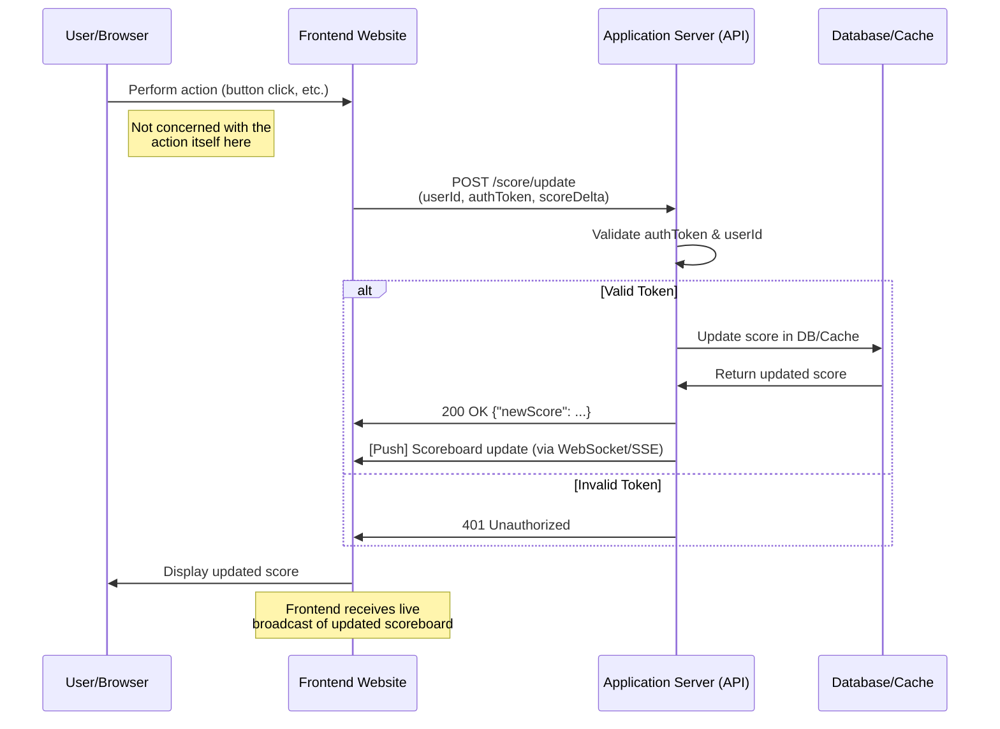

# Prerequisites

Please install Mermaid extension on VSCode editor, if you use VSCode.
Otherwise please try it online to view this document clearly

# Live Scoreboard API Module

This document outlines the specifications for a **Live Scoreboard API** module that will be implemented on the application server (backend). The goal is to enable real-time updates of a scoreboard displaying the top 10 user scores, ensure secure score updates, and prevent malicious score modifications.

---

## Overview

- We have a web application displaying a scoreboard of top 10 user scores.
- Users can perform certain actions (not detailed here) that increase their scores.
- Once a user completes an action, it triggers an API call to update that user’s score.
- The scoreboard should update in real time on the website.
- We need to ensure only authorized updates are processed.

### Key Objectives

1. **Real-Time Updates**: The scoreboard must always reflect the current state of the top 10 scores.
2. **Authorization**: Prevent unauthorized users or requests from artificially inflating scores.
3. **Simplicity**: The API design should be straightforward for clients to integrate with.

---

## Functional Requirements

1. **Fetch Top 10 Scores**

   - **Endpoint**: `GET /scoreboard`
   - **Description**: Retrieves the current top 10 scores, sorted in descending order.
   - **Response Format** (example):
     ```json
     {
       "data": [
         {"userId": "user123", "score": 150},
         {"userId": "user456", "score": 120},
         ...
       ]
     }
     ```
   - **Success Code**: `200 OK`
   - **Error Codes**:
     - `500 Internal Server Error` (on unexpected errors)

2. **Update User Score**

   - **Endpoint**: `POST /score/update`
   - **Headers**: Use Authorization header to perform authorization and detect the right user
   - **Request Body** (example):
     ```json
     {
       "userId": "user123",
       "scoreDelta": 10
     }
     ```

     - `userId`: Unique identifier of the user whose score should be updated.
     - `scoreDelta`: The amount by which the score should be incremented (or the new score, depending on implementation preference).

   - **Description**: Increments (or updates) a user’s score securely.
   - **Response Format** (example):
     ```json
     {
       "message": "Score updated successfully",
       "newScore": 160
     }
     ```
   - **Success Code**: `200 OK`
   - **Error Codes**:
     - `401 Unauthorized` if the `Authorization token` is invalid or expired.
     - `400 Bad Request` if required fields are missing or invalid.
     - `500 Internal Server Error` for unexpected failures.

3. **Real-Time Scoreboard Updates**  
   The backend should broadcast score changes to all connected clients in real time. This can be achieved using:
   - **WebSockets** – The server pushes events when a new top 10 scoreboard is computed.
   - **Server-Sent Events (SSE)** – The server streams updates to subscribed clients.
   - **Long Polling** – If real-time protocols are not feasible, fallback to periodic polling by the client (less recommended for real-time). Perhaps this is the easiest approach among the solutions with the help of client-side libraries like Tanstack Query.

---

## Security Considerations

1. **Authentication & Authorization**

   - Each request to update scores must include a valid `authToken` (e.g., JWT).
   - The server must verify the token and ensure that the `userId` in the request matches the user claims in the token.
   - This prevents malicious users from updating another user’s score.
   
2. **Input Validation**

   - Validate the `scoreDelta` or new score to ensure it follows the expected format and limits (e.g., not negative or excessively large).
   - Reject requests with invalid data to prevent SQL injection or data corruption.

3. **Rate Limiting** (optional but recommended)

   - Implement rate-limiting if necessary to prevent spam requests or DDoS attempts.

4. **Secure Communication**
   - All API calls should be made over HTTPS to prevent eavesdropping or tampering in transit.

---

## High-Level Architecture

Below is a simplified representation of the module flow:


